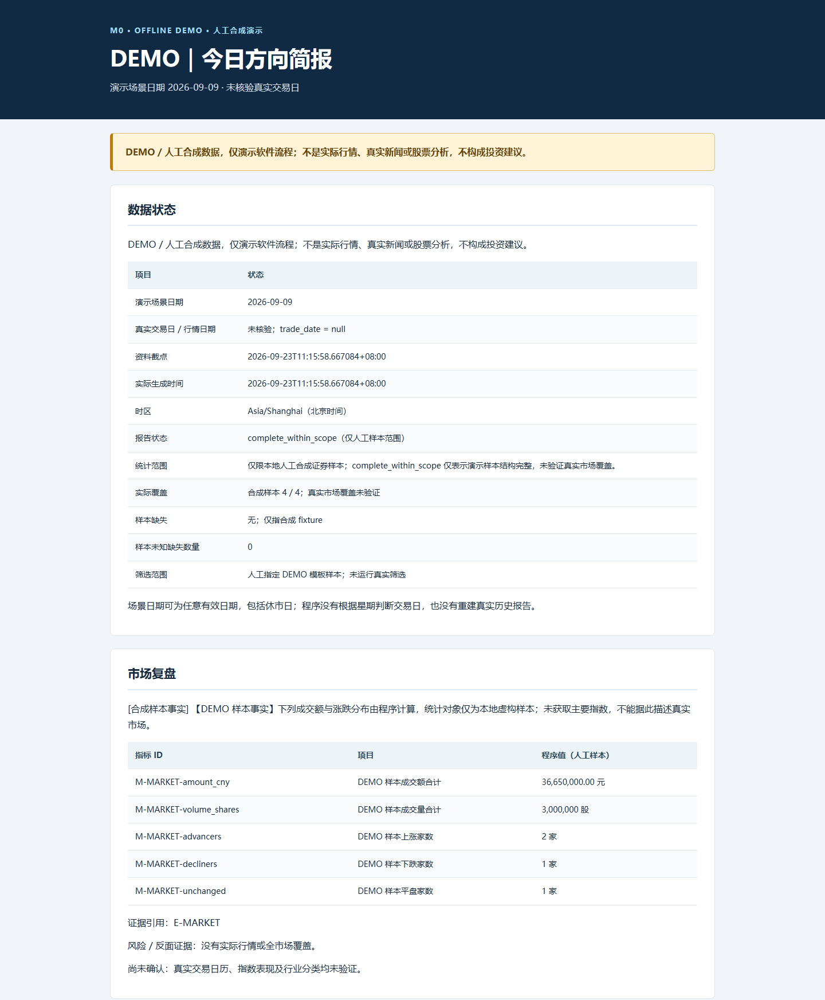

# 方向研究室 · AShare Compass

把盘后行情、规则筛选和可追溯资料整理成《今日方向简报》，在本地网页中查看候选、入选依据、风险和历史版本。

这是一个 **Python 实现的只读研究工具**。指标与排序由代码计算，模型仅为获准使用的文字资料提供背景解释。项目不接入券商、不管理账户、不下单，也不生成仓位、买卖数量或卖出策略。

## 能做什么

- **按行业缩小研究范围**：维护沪深普通 A 股名单，筛选行业并冻结成分集合，再为选中集合准备历史行情。
- **生成量价观察名单**：检查趋势、成交额、相对强弱和证券资格，分别展示候选、未通过和数据不足的原因，允许零候选。
- **补充研究背景**：按配置读取财务资料、新闻与政策材料；资料缺失和模型失败会明确显示。
- **保留证据与版本**：记录来源、首次观察时间、资料截点和内容哈希；后续补跑生成独立版本。
- **阅读与导出**：Streamlit 网页提供总览、个股详情、筛选明细、原文与证据、导出视图，报告支持 HTML、Markdown、JSON 和 CSV。
- **本地运行与维护**：提供命令行、任务锁、模型预算、备份和独立恢复工具。

当前主要研究入口是 `config/sector_observation_daily.json`，范围为沪市主板、深市主板、创业板和科创板，暂不含北交所。行业外个股不在这条流程的研究范围内，不能把结果解释为全市场机会扫描。

## 日报截图

下图为离线 DEMO 生成的 HTML 日报节选，展示数据状态与市场复盘。证券、消息和数值均为人工合成，仅用于展示报告结构。



## 快速体验：离线演示

需要 **Python 3.12**。在克隆后的项目根目录运行；首次安装依赖需要联网，演示日报不请求真实行情、新闻或模型，也不需要 API Key。

### Windows PowerShell

```powershell
powershell -NoProfile -ExecutionPolicy Bypass -File .\scripts\setup.ps1
.\.venv\Scripts\python.exe -m ashare_daily doctor --offline
.\.venv\Scripts\python.exe -m ashare_daily brief --mode demo --date 2026-09-09
```

打开生成的 HTML：

```powershell
$demoReport = Get-Content -LiteralPath .\outputs\demo\latest.json -Raw -Encoding UTF8 | ConvertFrom-Json
Invoke-Item -LiteralPath $demoReport.html
```

### Linux

先准备 Python 3.12 和对应的 venv 支持，再安装锁定依赖：

```bash
python3.12 -m venv .venv
.venv/bin/python -m pip install --require-hashes -r requirements-linux.lock
.venv/bin/python -m pip install --no-deps --no-build-isolation -e .
.venv/bin/python -m ashare_daily doctor --offline
.venv/bin/python -m ashare_daily brief --mode demo --date 2026-09-09
```

命令会输出报告路径。演示内容带有 **DEMO** 标记，日期只是演示场景参数，证券、消息和数值均不能作为真实研究结果。

## 使用真实数据

先阅读[使用指南](docs/USAGE.md)和[数据来源与访问边界](docs/DATA_SOURCES.md)，检查运行环境、来源权限及调用预算。以下命令仅预览当前观察流程，不发起行情、网页或模型请求：

```powershell
.\.venv\Scripts\python.exe -m ashare_daily run-daily --config config/sector_observation_daily.json --dry-run
```

**请显式指定配置文件。** 无参数 `run-daily` 保留兼容用的全市场流程，不能代替上述行业观察入口。仓库保留的其他配置包含早期样本与工程验证用途；部分来源已有启用标记，配置中的历史许可记录不代表对每位使用者的授权。

行情和模型接入是两件事。离线演示不需要 `.env`；启用模型时，在本机根据 [.env.example](.env.example) 填写服务地址、模型名和密钥。实际 `.env`、原始采集数据、日志和生成报告不应提交到仓库。

启动本地阅读页面：

```powershell
.\.venv\Scripts\python.exe -m streamlit run streamlit_app.py --server.address 127.0.0.1 --server.port 8501
```

访问 <http://127.0.0.1:8501>。网页只读取已有报告；首次克隆没有真实日报，启动页面不会自动采集数据。Linux 将 Python 路径替换为 `.venv/bin/python`。

## 策略与限制

当前观察策略要求足够的有效历史，检查 20 日平均成交额、`收盘价 > MA20 > MA60` 及相对基准强弱，并保留证券身份、上市状态、非 ST、非停牌等资格检查。阈值和版本见 [sector_screening_f4s1.json](config/sector_screening_f4s1.json)。当前配置不把退市整理期作为正式资格门槛；旧报告仍保留其冻结时的规则。

财务补充、新闻背景和[参考策略辅助评分](docs/REFERENCE_STRATEGY.md)各自显示资料状态。辅助分数不改变正式候选资格和排序，也不是上涨概率。量价通过不代表公司公告、财务与经营风险已经完整核查。

项目不保证每天有候选、不保证数据源持续可用，也没有经过验证的盈利或胜率承诺。历史补采与工程验证会保留相应用途标记，不能冒充当时已生成的实时研究。

## 文档与开发

| 文档 | 内容 |
| --- | --- |
| [使用指南](docs/USAGE.md) | 安装、离线演示、观察流程、模型配置和阅读页面 |
| [研究范围](docs/00_SCOPE_CHANGE.md) | 产品边界、资格策略与证据要求 |
| [架构与开发](docs/ARCHITECTURE.md) | 目录、数据流、测试和贡献约定 |
| [数据来源](docs/DATA_SOURCES.md) | 适配器、权限开关、数据与模型使用边界 |
| [Linux 部署与备份](docs/25_DEBIAN_DEPLOYMENT.md) | 本地监听、调度注意事项、备份与恢复 |

部署地址、账号和目录通过被 Git 忽略的 `.local/deployment.json` 或命令参数提供，公开模板见 [deployment.example.json](config/deployment.example.json)。模板不包含密码或密钥。

```powershell
.\.venv\Scripts\python.exe -X utf8 -m pytest --basetemp .t/pytest
```

Windows 测试显式使用 UTF-8 和较短的临时路径，避免默认编码与深层路径限制。`.t/pytest` 是可清理的测试目录，请勿存放个人文件。测试以离线夹具为主；测试通过不能代替真实数据源连通性、权限、覆盖率或服务器验收。参与开发前请阅读 [AGENTS.md](AGENTS.md)。

仓库目前未附项目许可证。公开可见与授予开源使用许可是不同事项；依赖及参考资料的许可应分别核对。
